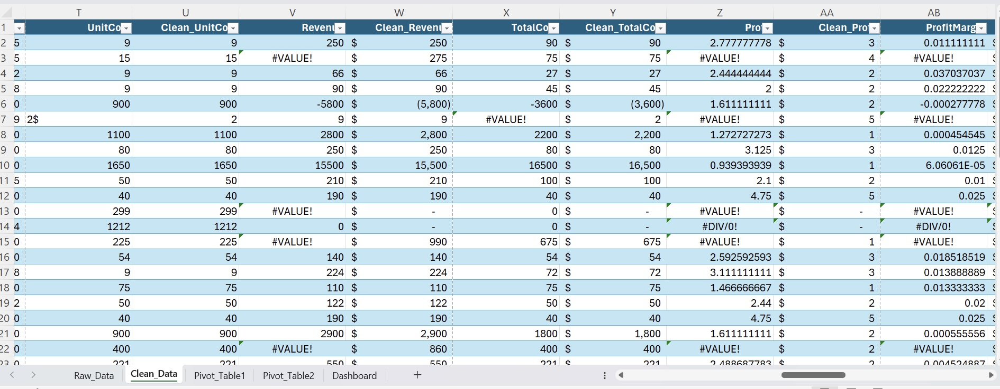
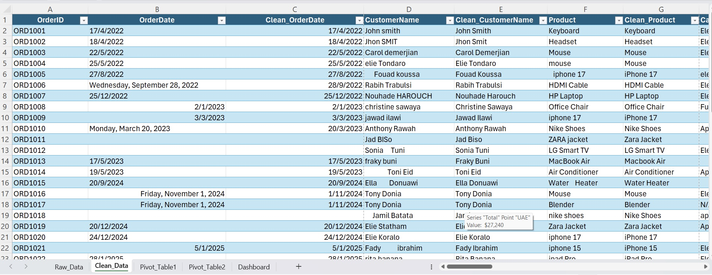
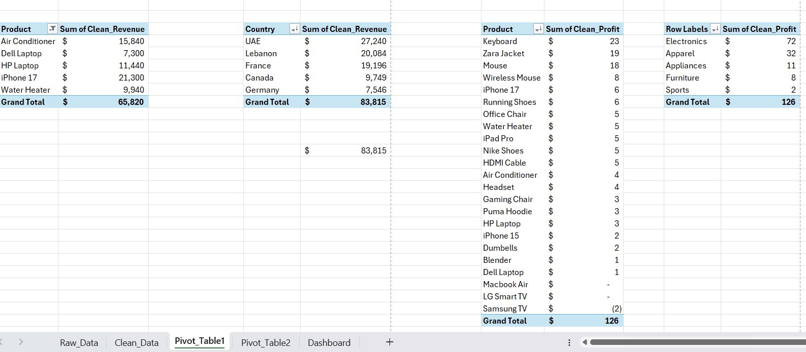
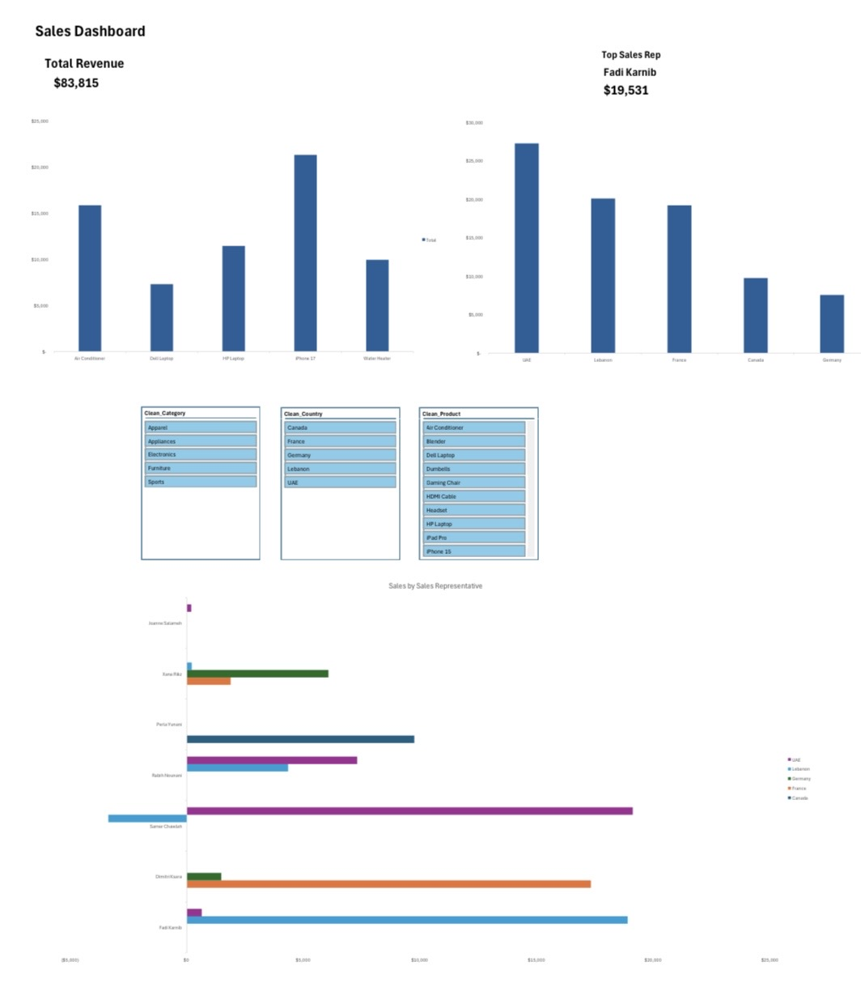
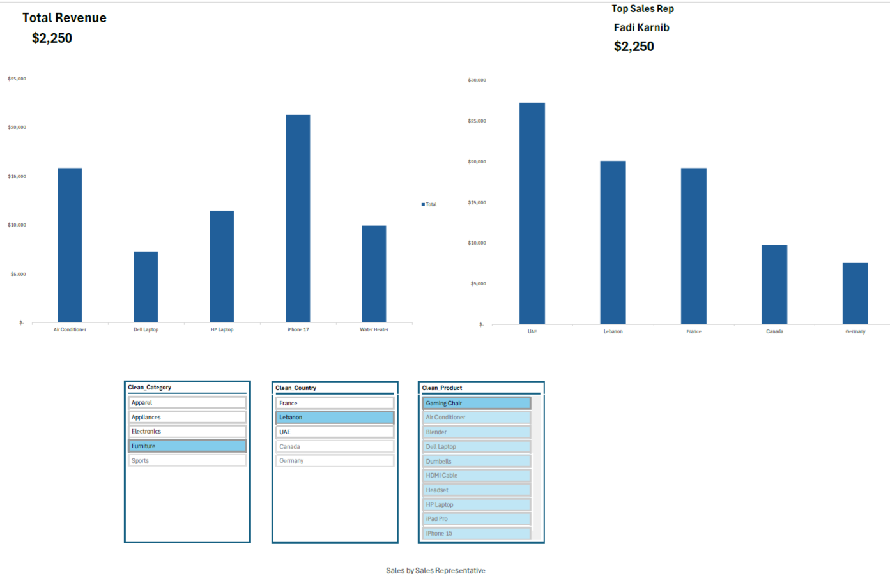

# Excel Sales Analysis

End-to-end **Excel** sales analytics project: from raw messy data to a fully interactive dashboard. Demonstrates the real-world data analyst workflow inside Excel — data cleaning, transformation, pivot analysis, and visual storytelling.

---

## Project Workflow

### 1. Data Cleaning — Numbers & Currencies

Raw data contained `#VALUE!` errors caused by inconsistent formatting (mixed currency symbols, text-as-numbers, blank cells). Cleaned each numeric column using:

- **`VALUE()`** — convert text-formatted numbers into real numbers
- **`SUBSTITUTE()`** — strip unwanted characters (`$`, spaces, etc.)
- **`IF()`** — handle blanks and edge cases gracefully

Built a parallel `Clean_` column for every raw column (Clean_UnitCost, Clean_Revenue, Clean_TotalCost, Clean_Profit, ProfitMargin) so the original data stays intact and the cleaning logic is fully auditable.

### 2. Data Cleaning — Text & Dates

Raw text fields were inconsistent — names in mixed case, extra spaces, dates in different formats. Cleaned using:

- **`TRIM()`** — remove extra spaces in names and product fields
- **`PROPER()`** — standardize capitalization for customer names
- **`XLOOKUP()`** — normalize product names against a reference list
- Date standardization across multiple input formats

### 3. Pivot Analysis

Multiple pivot tables analyzing the cleaned dataset across different dimensions: **Revenue by Product**, **Revenue by Country**, **Profit by Product**, and **Profit by Category**.

### 4. Interactive Sales Dashboard

Final dashboard combining KPIs, charts, and slicers:

- **Total Revenue:** $83,815
- **Top Sales Rep:** Fadi Karnib ($19,531)
- **Revenue by Product** — bar chart
- **Revenue by Country** — bar chart (UAE leads at $27,240)
- **Sales by Sales Representative** — color-coded by country
- Slicers for Category, Country, and Product

### 5. Interactivity in Action

The dashboard updates dynamically as filters are applied. Example: filtering to **Lebanon + Furniture** narrows the view to $2,250 in revenue — letting stakeholders drill into specific market segments.

---

## Tech Stack

- **Microsoft Excel** — data cleaning, modeling, dashboarding
- **Excel Functions:** `XLOOKUP`, `IF`, `TRIM`, `VALUE`, `SUBSTITUTE`, `PROPER`
- **Pivot Tables** — multi-dimensional aggregation
- **Slicers** — interactive filtering
- **Charts** — bar, column, clustered visuals

## What's Inside

- **Raw_Data sheet** — original messy dataset
- **Clean_Data sheet** — cleaned/transformed columns alongside originals (auditable)
- **Pivot_Table1 + Pivot_Table2** — analytical pivot views
- **Dashboard sheet** — interactive final report

## Key Insights

- Total revenue across the dataset: **$83,815**
- Top market: **UAE ($27,240)**, followed by Lebanon ($20,084) and France ($19,196)
- iPhone 17 is the **#1 product** by revenue ($21,300)
- **Fadi Karnib** is the leading sales rep ($19,531)

## Files in This Repository

| File | Description |
|------|-------------|
| `Elie_Zeraoui_Sales_Analysis.xlsx` | Full Excel workbook (Raw, Clean, Pivots, Dashboard) |
| `CleanData1.jpeg` | Data cleaning preview — numbers & currencies |
| `CleanData2.jpeg` | Data cleaning preview — text & dates |
| `PivotAnalysis.jpeg` | Pivot tables analysis |
| `SalesAnalysis.jpeg` | Final interactive dashboard |
| `SalesAnalysis2.png` | Dashboard with filters applied (Lebanon + Furniture) |

## See It on LinkedIn

[View the project post on LinkedIn](https://linkedin.com/posts/elie-zeraoui-7a5a04267_dataanalytics-excel-powerbi-activity-7454860933547393024-RLII)

---

Built by **[Elie Zeraoui](https://github.com/elie-zeraoui)** — Data Analyst | Computer Science Graduate
